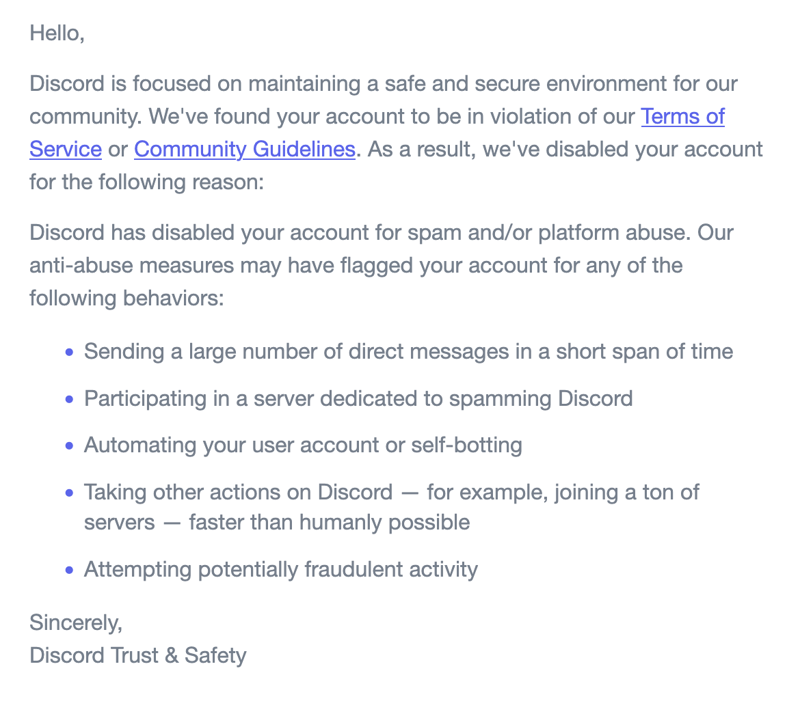

# discord-friender

Automation for sending Discord friend requests from members of a target guild.

It uses `discord.py-self` for user-account automation, stores request state in SQLite (`friend_requests.db`), and optionally solves hCaptcha via NopeCHA.

## Setup

```bash
uv sync
cp .env.example .env
```

Fill `.env`:

- `DISCORD_TOKEN` (user token)
- `GUILD_ID` (target server id)
- `NOPECHA_KEY` (required if captchas appear)

How to get those values:

- `GUILD_ID`: in Discord, open `User Settings -> Advanced -> Developer Mode` (enable), then right-click the target server and click `Copy Server ID`.
- `DISCORD_TOKEN`: log into Discord in a browser, open DevTools, and copy your own account token from web app storage/network auth headers. Treat it like a password; never share it or commit it.
- `NOPECHA_KEY`: create an account at `nopecha.com`, add balance/plan as needed, then copy your API key from the NopeCHA dashboard into `.env`.

## Run

```bash
# preview targets only
uv run python main.py --dry-run

# send a small batch first
uv run python main.py --limit 5

# show sqlite stats from previous runs
uv run python main.py --stats

# test captcha solver only
uv run python main.py --test-captcha
```

## Config knobs

Rate controls from `.env`:

- `REQUEST_DELAY_MIN` / `REQUEST_DELAY_MAX`
- `BATCH_SIZE`
- `BATCH_PAUSE`
- `SKIP_BOTS`

Delay/captcha tradeoff:

- Lower delays send faster but increase rate-limit/captcha risk. Start around `30-60s` and use small `--limit` tests first.
- If captchas start appearing, increase delays and/or batch pauses. The code already auto-slows delays by `1.5x` (up to `120-180s`) after captcha failures.
- Captcha solve time is variable. A successful solve is often tens of seconds to ~2 minutes; failed solves can take up to about 6 minutes total (3 attempts, 120s timeout each, with short retry gaps).

Optional captcha proxy:

- `PROXY_SCHEME`, `PROXY_HOST`, `PROXY_PORT`, `PROXY_USER`, `PROXY_PASS`

## Notes

- The scraper tries member discovery in this order: cache -> `fetch_members` -> `chunk`.
- Every attempt is recorded in SQLite with status + error details.
- Start with `--dry-run` and low limits before larger runs.

## Account Risk Disclaimer

Using this tool can get your Discord account rate-limited, locked, or permanently disabled for spam/platform abuse or self-botting. You are fully responsible for that risk.

Use at your own risk, test slowly, and assume account loss is possible even with conservative settings.



I got this after the second time using the script—though the script did work very well! Possibly we need to increase the delay times, I will test on a newer account as well.
